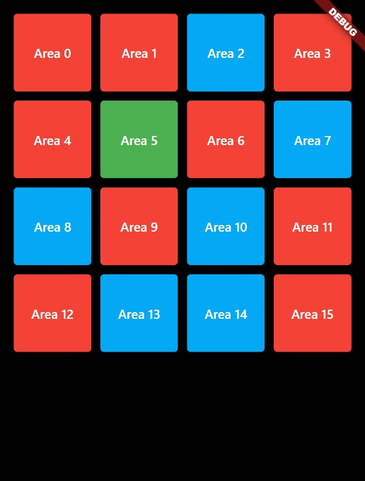

# Grid View in flutter

## Treasure Hunt Game



## Code

```dart
import 'package:flutter/material.dart';
import 'dart:math';

class MyGridView extends StatefulWidget {
  const MyGridView({super.key});

  @override
  State<MyGridView> createState() => _MyGridViewState();
}

class _MyGridViewState extends State<MyGridView> {
  int _location = 0;
  late List<Area> _areas;

  void initState() {
    super.initState();
    _areas = List<Area>.generate(16, (int index) {
      return Area(index: index, name: "Area $index");
    });

    var rng = Random();
    _location = rng.nextInt(_areas.length);
  }

  Widget generate(int index) {
    return GridTile(
        child: Container(
            padding: const EdgeInsets.all(5.0),
            // color: _areas[index].color,
            child: ElevatedButton(
              onPressed: () => _onPressed(index),
              style: ButtonStyle(
                  backgroundColor:
                      MaterialStateProperty.all<Color>(_areas[index].color)),
              child: Text(
                _areas[index].name,
                textAlign: TextAlign.center,
              ),
            )));
  }

  void _onPressed(int index) => setState(() {
        if (index == _location) {
          _areas[index].color = Colors.green;
        } else {
          _areas[index].color = Colors.red;
        }
      });

  @override
  Widget build(BuildContext context) {
    return Container(
        padding: const EdgeInsets.all(10.0),
        child: GridView.builder(
            itemCount: _areas.length,
            gridDelegate: const SliverGridDelegateWithFixedCrossAxisCount(
                crossAxisCount: 4),
            itemBuilder: (BuildContext context, int index) {
              return generate(index);
            }));
  }
}

class Area {
  int index;
  String name;
  Color color;

  Area({this.index: -1, this.name: "Area", this.color: Colors.lightBlue});
}
```
