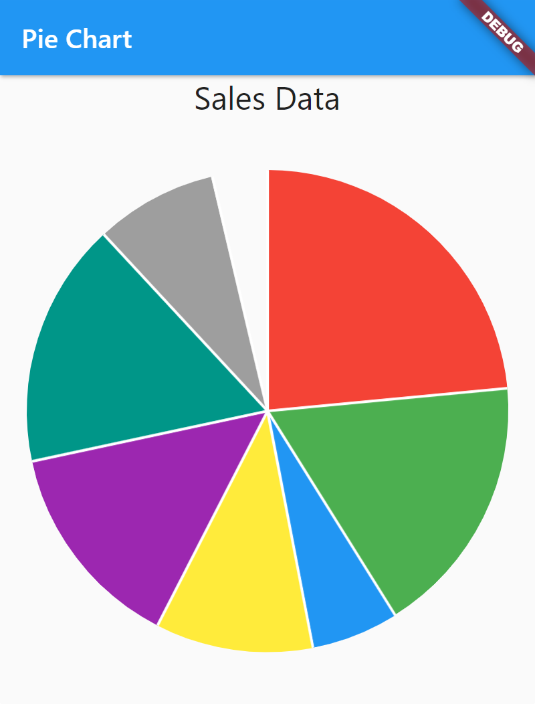

# Flutter Charts: Animated Pie Charts



## Code

```dart
import 'package:flutter/material.dart';
import 'dart:math';
import 'package:charts_flutter/flutter.dart' as charts;

class Sales {
  late String year;
  late int sales;
  charts.Color color;

  Sales(this.year, this.sales, this.color);
}

class PieChart extends StatefulWidget {
  const PieChart({super.key});

  @override
  State<PieChart> createState() => _PieChartState();
}

class _PieChartState extends State<PieChart> {
  late List<Sales> _data;
  late List<charts.Series<Sales, String>> _chartsData;

  void _makeData() {
    _data = [
      Sales('0', 100, charts.MaterialPalette.red.shadeDefault),
      Sales('1', 75, charts.MaterialPalette.green.shadeDefault),
      Sales('2', 25, charts.MaterialPalette.blue.shadeDefault),
      Sales('3', 45, charts.MaterialPalette.yellow.shadeDefault),
      Sales('4', 60, charts.MaterialPalette.purple.shadeDefault),
      Sales('5', 70, charts.MaterialPalette.teal.shadeDefault),
      Sales('6', 35, charts.MaterialPalette.gray.shadeDefault),
    ];
    _chartsData = <charts.Series<Sales, String>>[];
    final chartSeries = charts.Series<Sales, String>(
      id: 'Sales',
      domainFn: (Sales sales, _) => sales.year,
      measureFn: (Sales sales, _) => sales.sales,
      colorFn: (Sales sales, _) => sales.color,
      data: _data,
    );
    _chartsData.add(chartSeries);
  }

  @override
  void initState() {
    super.initState();
    _makeData();
  }

  @override
  Widget build(BuildContext context) {
    return Scaffold(
      appBar: AppBar(
        title: const Text('Pie Chart'),
      ),
      body: Center(
          child: Column(
        children: [
          const Text(
            'Sales Data',
            style: TextStyle(fontSize: 24.0),
          ),
          Expanded(
              child: charts.PieChart(
            _chartsData,
            animate: true,
            animationDuration: const Duration(seconds: 5),
          )),
        ],
      )),
    );
  }
}

```
