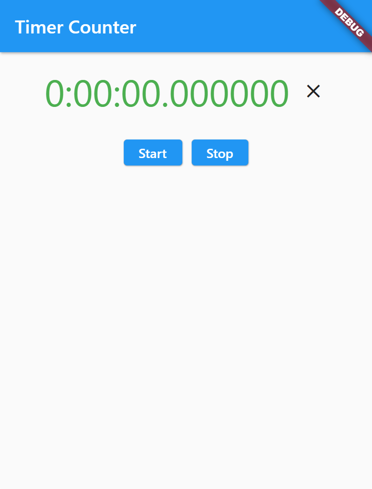

# Stop Watch in Flutter

## Communication between parent to child widget



## display timer code

```dart
import 'package:flutter/material.dart';

// ignore: must_be_immutable
class TimeDisplay extends StatelessWidget {
  Duration duration = Duration.zero;
  Color color = Colors.green;
  final ValueChanged<Duration> onClear;

  TimeDisplay({
    key,
    required this.duration,
    required this.onClear,
  }) : super(key: key);

  void _onClick() => onClear(duration);

  @override
  Widget build(BuildContext context) {
    return Row(
      mainAxisAlignment: MainAxisAlignment.center,
      children: [
        Padding(
          padding: const EdgeInsets.all(5.0),
          child: Text(
            duration.toString(),
            style: TextStyle(
              fontSize: 40,
              color: color,
            ),
          ),
        ),
        IconButton(
          icon: const Icon(Icons.close),
          onPressed: _onClick,
        ),
      ],
    );
  }
}
```

## time counter code

```dart
import 'package:flutter/material.dart';
import 'dart:async';

import 'package:flutter_bryan/stopwatch/timer_display.dart';

class TimeCounter extends StatefulWidget {
  const TimeCounter({super.key});

  @override
  State<TimeCounter> createState() => _TimeCounterState();
}

class _TimeCounterState extends State<TimeCounter> {
  late Stopwatch _stopwatch;
  late Timer _timer;
  late Duration _duration;

  void onStart() => setState(() {
        _stopwatch = Stopwatch();
        _timer = Timer.periodic(const Duration(milliseconds: 100), onTimeout);
        _stopwatch.start();
      });

  void onStop() {
    _timer.cancel();
    _stopwatch.stop();
  }

  void onTimeout(Timer timer) {
    if (_stopwatch.isRunning) {
      setState(() {
        _duration = _stopwatch.elapsed;
      });
    }
  }

  void onClear(Duration value) => setState(() => _duration = const Duration());

  @override
  void initState() {
    super.initState();
    _duration = const Duration();
  }

  @override
  Widget build(BuildContext context) {
    return Scaffold(
        appBar: AppBar(
          title: const Text('Timer Counter'),
        ),
        body: Container(
          padding: const EdgeInsets.all(10.0),
          child: Center(
              child: Column(
            children: [
              TimeDisplay(duration: _duration, onClear: onClear),
              const SizedBox(height: 20.0),
              Row(
                mainAxisAlignment: MainAxisAlignment.center,
                children: [
                  ElevatedButton(
                    onPressed: onStart,
                    child: const Text('Start'),
                  ),
                  const SizedBox(width: 10.0),
                  ElevatedButton(
                    onPressed: onStop,
                    child: const Text('Stop'),
                  ),
                ],
              )
            ],
          )),
        ));
  }
}
```
